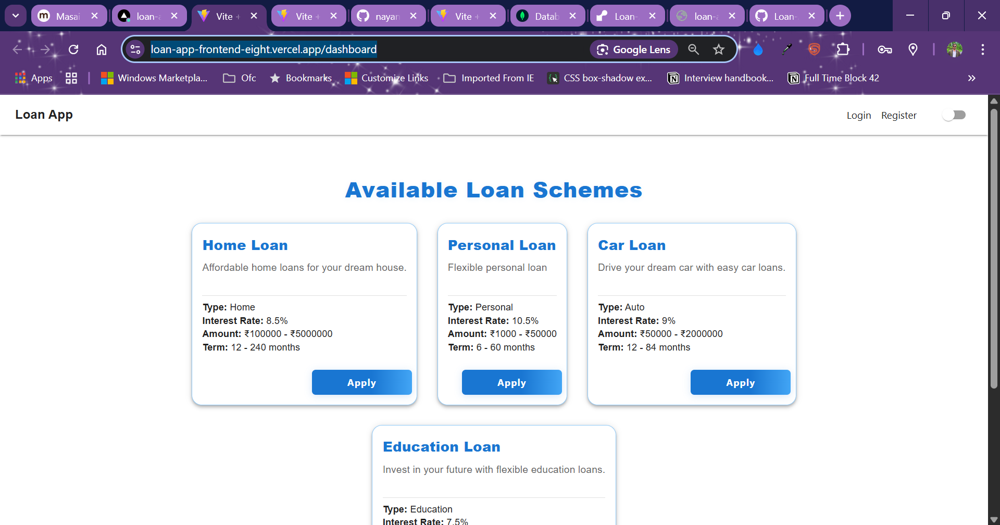
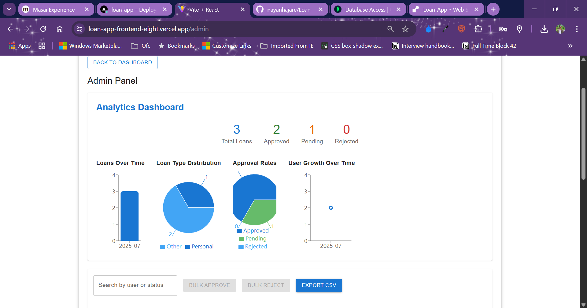

# 📝 Loan Application System - Frontend

A modern frontend web application built with **React** and **Material UI**, featuring real-time dashboard, JWT authentication, KYC management, admin analytics, notifications, and seamless backend API integration.

> *A comprehensive Loan Management platform for users and admins, with beautiful UI, secure authentication, and advanced analytics.*

---
## Git hub
🔗 **Frontend GitHub Repo:** https://github.com/nayanhajare/Loan-App-frontend
🔗 **Backend GitHub Repo:**https://github.com/nayanhajare/Loan-App-Backend

## 🚀 Live Demo

🌐 [Live App](#) (https://loan-35pp9t29c-nayan-hajares-projects.vercel.app)

---

## 📸 Screenshots


.png)
.png)
![Admin Analytics]
.png)
.png)
.png)
.png)
.png)

---

## 🎥 Video Walkthrough

Project Walkthrough :https://youtu.be/5cf7nzyn-P8
Project based question : https://youtu.be/zrRxu85oIuw
---

## 🛠 Features

### 🔐 Authentication & Authorization
* **User Registration & Login** with JWT
* **Role-Based Access Control** (User/Admin)
* **Protected Routes** and secure session management

### 📊 Dashboard & Loan Management
* **Responsive dashboard** with loan schemes, calculator, and payment reminders
* **Apply for loans**, view status, repayment calendar
* **Download repayment schedule** (CSV)
* **Real-time notifications** (EMI due, approval, etc.)

### 📁 Document & KYC Management
* **Upload KYC documents** (PAN, Aadhaar, Passport, etc.)
* **View KYC status** (pending, approved, rejected)
* **Admin review and approval**

### 🧑‍💼 Admin Panel
* **User and loan management**
* **Advanced analytics dashboard** (charts, stats)
* **Audit log of all actions**
* **Bulk actions** (approve/reject)

### 🎨 User Experience
* **Responsive design** (mobile/tablet/desktop)
* **Dark mode toggle**
* **Modern UI/UX** with Material UI
* **Accessibility & keyboard navigation**

### 🔧 Technical Features
* **RESTful API integration**
* **Async/await, error handling**
* **Modular React architecture**
* **State management with Context API**

---

## 📁 Project Structure

```
frontend/
├── src/
│   ├── components/      # Reusable UI components
│   ├── pages/           # Main app pages
│   ├── context/         # Context providers (auth, theme, notifications)
│   ├── services/        # API integration
│   └── ...
├── public/              # Static assets
├── package.json         # Dependencies
└── README.md            # This file
```

---

## 🧠 Concepts Demonstrated
* **React hooks, context, and routing**
* **Material UI theming and components**
* **JWT authentication and protected routes**
* **Responsive, accessible design**
* **Real-time notifications**
* **Charting with recharts**

---

## 🔌 Backend API Integration

The frontend integrates with a Node.js/Express backend:
* `/api/auth` - Auth routes (register, login)
* `/api/loans` - Loan application and management
* `/api/loan-products` - Loan product catalog
* `/api/documents` - Document upload and KYC
* `/api/users` - User management (admin)
* `/api/audit-logs` - Audit log (admin)

---

## 🧪 How to Run Locally

### Prerequisites
* Node.js (v16+ recommended)
* npm
* Backend server running (see backend README)

### Setup Steps
```bash
cd frontend
npm install
npm start
```
The app will run at [http://localhost:3000](http://localhost:3000)

---

## 🧱 Tech Stack
* **React**
* **Material UI**
* **Recharts** (analytics)
* **Context API**
* **Fetch/Axios**
* **Jest/RTL** (for testing)

---

## 🐛 Troubleshooting
* Ensure backend is running on correct port
* Check browser console for errors
* Verify API endpoints in `src/services/api.js`

---

## 📄 License
MIT

---

## 👤 Author
**Nayan Hajare**

---

## 🙏 Acknowledgments
* Masai School
* React & Material UI communities
* MDN Web Docs
* Stack Overflow

---

> *For backend setup and API details, see the backend/README.md*
